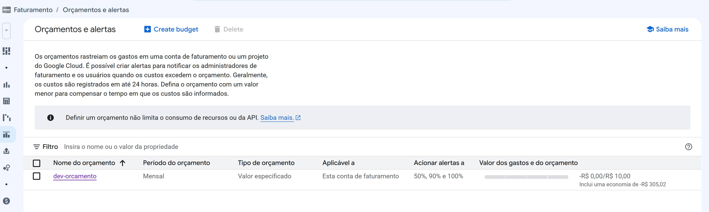
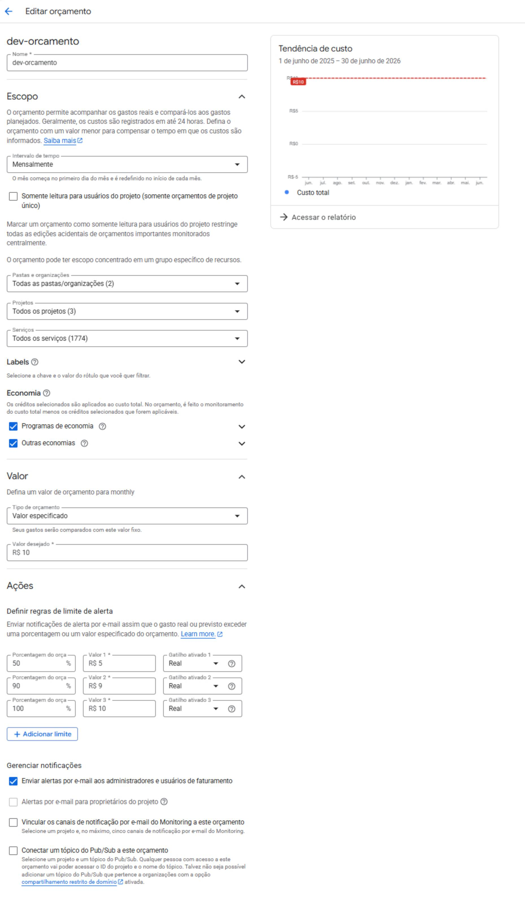

# Definição de Orçamento de Billing na Google Cloud Platform

## Visão Geral

Este documento descreve a configuração de **orçamentos e alertas de faturamento** no Google Cloud Platform (GCP), utilizando as ferramentas nativas do **Cloud Billing**.

A estrutura apresentada aqui complementa a organização de projetos e grupos de acesso definida no README anterior, garantindo **controle financeiro** sobre os recursos provisionados via Terraform.

---

## Tecnologias Utilizadas

| Tecnologia | Finalidade no contexto de orçamento |
|------------|--------------------------------------|
| **GCP Cloud Billing** | Gerenciamento de custos, orçamentos e alertas |
| **GCP Console** | Interface para criação e visualização dos orçamentos |
| **Terraform** | Provisionamento dos orçamentos como código (opcional) |

---

## Primeira Imagem – Configuração do Orçamento no GCP Console

A imagem abaixo mostra a interface do **Google Cloud Console** na seção de orçamentos, onde o orçamento `dev-orcamento` foi configurado.



### Explicação da primeira imagem

Conforme ilustrado na **imagem acima**, temos as seguintes informações:

| Campo | Valor / Configuração |
|-------|----------------------|
| **Título da seção** | Faturamento / Orçamentos e alertas |
| **Orçamento criado** | `dev-orcamento` |
| **Período do orçamento** | Mensal |
| **Tipo de orçamento** | Valor especificado |
| **Aplicável a** | Esta conta de faturamento |
| **Acionar alertas a** | 50%, 90% e 100% do orçamento |
| **Valor do orçamento** | R$ 10,00 |
| **Gastos atuais** | -R$ 0,00 (com economia de -R$ 305,02) |

**Observações importantes (presentes na imagem):**
- Os custos são registrados em até **24 horas**.
- O orçamento **não limita o consumo** de recursos ou APIs — apenas gera alertas.
- É possível filtrar orçamentos por nome ou valor.

---

## Segunda Imagem – Período e Valores do Orçamento

A imagem abaixo detalha o **período de vigência** e os **limites financeiros** configurados para o orçamento.



### Explicação da segunda imagem

Conforme ilustrado na **imagem acima**, o orçamento cobre o período de:

| Data de início | Data de término |
|----------------|-----------------|
| **1 de junho de 2025** | **30 de junho de 2026** |

Os limites configurados são:

| Limite | Valor (R$) | Status |
|--------|------------|--------|
| Orçamento total | R$ 10,00 | Definido |
| Alerta 50% | R$ 5,00 | Acionado quando atinge R$ 5,00 |
| Alerta 90% | R$ 9,00 | Acionado quando atinge R$ 9,00 |
| Alerta 100% | R$ 10,00 | Acionado quando atinge ou ultrapassa R$ 10,00 |

> **Nota:** Os valores R$ 0,00 e R$ 5,00 repetidos na imagem representam os limiares de alerta e os gastos parciais em diferentes momentos da medição.

---

## Como este orçamento se relaciona com a organização anterior

No README anterior, definimos:

- Projetos: `dev-devops-iac`, `dev-comercial-mobile-prod`, `dev-desenvolvimento-mobile-dev`, `dev-erp-dev`, `dev-erp-prod`
- Grupos de acesso: `devops`, `sre`, `marketing`, `financeiro`, `walmirpacheco.com`

O orçamento `dev-orcamento` se aplica:

| Projeto / Grupo | Relação com o orçamento |
|----------------|--------------------------|
| **Conta de faturamento inteira** | O orçamento cobre TODOS os projetos listados |
| **Grupo financeiro** | Responsável por monitorar os alertas (50%, 90%, 100%) |
| **Grupo devops/sre** | Devem otimizar recursos para não estourar o orçamento de R$ 10,00 |
| **Período de 13 meses** (jun/2025 a jun/2026) | Planejamento financeiro de longo prazo |

---

## Exemplo de configuração via Terraform

Caso queira provisionar este mesmo orçamento via Infraestrutura como Código:

```hcl
# main.tf
resource "google_billing_budget" "dev_orcamento" {
  billing_account = "012345-6789AB-CDEFGH" # Substitua pelo ID da sua conta
  
  display_name = "dev-orcamento"
  
  budget_filter {
    projects = [] # Vazio = aplica a toda conta de faturamento
  }
  
  amount {
    specified_amount {
      currency_code = "BRL"
      units         = "10"
      nanos         = 0
    }
  }
  
  threshold_rules {
    threshold_percent = 0.50  # Alerta em 50%
  }
  
  threshold_rules {
    threshold_percent = 0.90  # Alerta em 90%
  }
  
  threshold_rules {
    threshold_percent = 1.0   # Alerta em 100%
  }
}